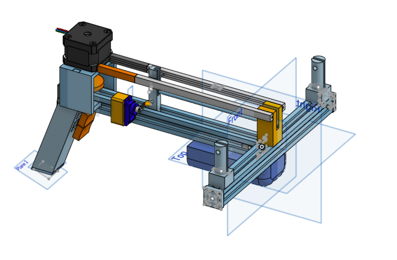

# Crossbow

This is a automated (partially) crossbow that @Overlord-Runt and @Person20020 built together for Undercity.

## Inspiration

@Overlord-Runt - I come from a place where its illegal to make weapons. So Now in the land of the free, it became my mission to make a gun. And the original plan was to make a gun. However, we ran into a few roadblocks, First we had 2 steppers but only 1 driver and that 1 driver did not feel like it could deliver enough power to feul both without blowing. so at the end of day 2 we did a complete restart and started making a crossbow instead. We had a model done by the start of day 3 but it kept failing and by the end of day 3, we did extreme simplifications and min maxxed it to print as fast as possible and hopefully not fail.

Anyways we may or may not shoot Paolo with this

## CAD
We went through a lot of redesigns for the gun and 1 redeign for the crossbow. Im only gonna show the crossbow sides because the gun isnt relevant.

\
Here is our Finished Model. Amazing isnt it?

Here are some more angles vvvvv\
\

Here is what our original design looked like:

\

I really wanted to use this design but it just wasnt meant to be.

## FIRMWARE

Copilot is the absolute goat

## HOW TO BUILD
1. Print all the parts
2. Push the Heatsets into the Slot Connector
3. Slide the slot connector onto the middle of one extrusion and use a screw to hold it down
4. Attach the second extrusion normal to the first and hold down with screws
5. Slide in the Battery Box to the joint
6. Slide in the handle to the bottom of the T Frame
7. Hot Glue all crrent connections to secure them down
8. Attach the cross to the horizontal extrusion and Hot glue down
9. slide the peg into the top channel
10. slide the servo mount onto the side of the channel
11. Screw the stepper motor onto the mount
12. attach the spool to the stepper's rod
13. slide the mount onto the extrusion
14. Hot glue it down
15. Ensure the Servo Mount is 125mm away from the cross and hot glue down
16. Use zip ties and wires to brig all wires into the handle
17. Add an extra 4 wires through the switch holes(2 per hole)
18. ensure the wire pokes out/ is reachable from the outside
19. Wire the parts to the pico from the bottom of the handle as shown in the wiring diagram
20. Solder the whole thing
21. Push the pico into the handle, usb port side facing outwards
22. Pull out switch wires and solder to switches
23. Click Switches into handle
24. Put keycaps on switches
25. Melt the servo arm to any servo cross bit
26. screw it to the servo and screw the servo into the mount
27. tie the string to the peg and the other end to the spool
28. adjust length so the peg reaches the cross
29. Add pegs for the rubber bands to the ends of the cross and hold it down by any means nesasary. we used wires, zip ties, and supporting pieces
30. Flash Firmware
31. Adjust and tune to your individual specs(can change)

## BOM

 - 2x 2020 Aluminium Extrusions 250mm
 - 1x Orpheus Pico
 - 1x 9g Servo Motor
 - 1x 9V Battery
 - 1x 9V Battery Connector
 - 1x Nema17 Stepper Motor
 - 1x A4988 Stepper Motor Driver
 - 1x USB PD Trigger Board
 - 9x 3D Printed Parts
 - 8x Noodle Lights
 - 10x Zip Ties
 - 2x MX Switches
 - 2x Keycaps
 - 3x M3D5L4 Heatsets
 - 7x M3 Screws
 - 200mm String
 - 2 Rubber Bands
 - Hot Glue
 - Wires/Cables

