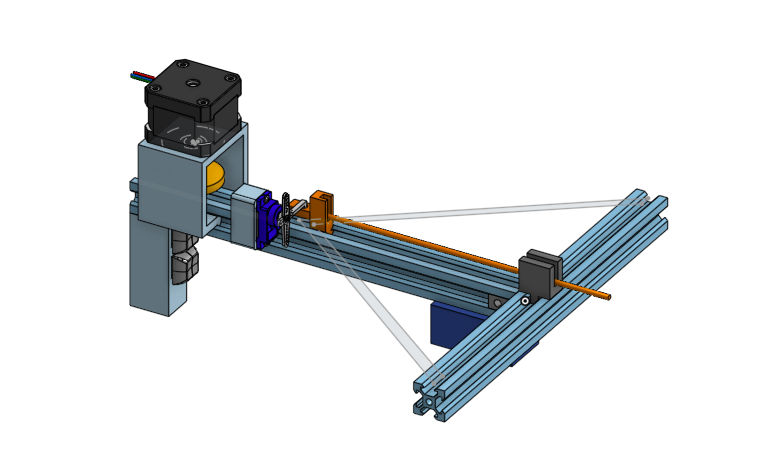

# Crossbow

This is a automated (partially) crossbow that @Overlord-Runt and @Person20020 built together for Undercity.

## Inspiration

@Overlord-Runt - I come from a place where its illegal to make weapons. So Now in the land of the free, it became my mission to make a gun. And the original plan was to make a gun. However, we ran into a few roadblocks, First we had 2 steppers but only 1 driver and that 1 driver did not feel like it could deliver enough power to feul both without blowing. so at the end of day 2 we did a complete restart and started making a crossbow instead. We had a model done by the start of day 3 but it kept failing and by the end of day 3, we did extreme simplifications and min maxxed it to print as fast as possible and hopefully not fail.

Anyways we may or may not shoot Paolo with this

## HOW DOES THIS WORK?
This thing is a crossbow that is automated(mostly) with 2 buttons. It uses one button to retract the peg and lock it, the other to shoot.

The retraction retracts the peg, uses a peg to lock it in place and then unwinds the roll to let the line slack fully. this makes it so the line doesnt add any resistance when you fire the crossbow

The second button just releases a mechanical system the=at fires the crossbow.

You will however need to load it yourself. that is the one manual part.

## CAD
We went through a lot of redesigns for the gun and 1 redeign for the crossbow. Im only gonna show the crossbow sides because the gun isnt relevant.

you can find a full build in the repo

\
Here is our Finished Model. Amazing isnt it?

Here are some more angles vvvvv\
\

Here is what our original design looked like:

\

I really wanted to use this design but it just wasnt meant to be. (OnShape made the constraints explode after modifying the dimensions of the aluminum extrusion because the parts didn't fit in it and because of this we decided it would be easier to start over rather than going through the entire timeline and fixing all of the references.)

## FIRMWARE

Copilot is the absolute goat. Together with the help of copilot, we busted out the code in under 2 hours. Kinda annoying when it gets stuff wrong but relatively good.

Its in a normal arduino code file and is about 100 lines long(i pressed enter 5 times). Most of our effort was put into engineering this thing to work so the firmware isnt that special.

It uses interupt functions for the button presses and only really does basic things

## HOW TO BUILD
1. Print all the parts
2. assemble print
3. make circuit
4. attach circuit to prints
5. shoot people

## BOM

## Wiring

(replace the arduino with a pico)

Here is a list of wiring connections:
 - Transistors in a h bridge formation
 - 2 data pins from pin 15 and 16 on the pico
 - thats about it lol
